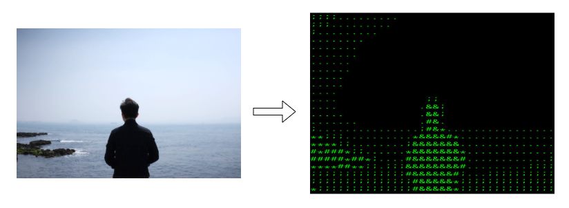

# AArt

Convert image to Ascii Art.


## Install

`$ cargo install aart`

## Usage

`$ aart image.jpg`

full usage:

```
USAGE:
    aart [OPTIONS] <image>

FLAGS:
    -h, --help       Prints help information
    -V, --version    Prints version information

OPTIONS:
    -s, --size <FONT SIZE>    Sets the font size(default: 18).
    -l, --letters <STRING>    Sets the letters used on output file.
    -o, --out <FILE>          Sets the output file(default: out.png)

ARGS:
    <image>    Sets the image file to convert
```

An example to use custom letters:

`$ aart image.jpg -l "&#*;. "`



## License

MIT [Chuang Yu<cyu9960@gmail.com>](https://github.com/cyyyu)